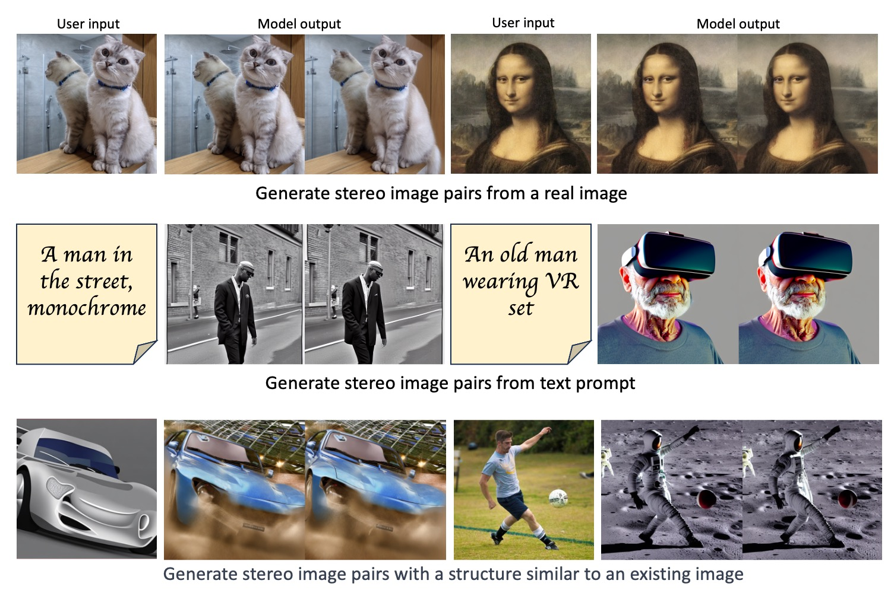

# StereoDiffusion: Training-Free Stereo Image Generation Using Latent Diffusion Models



### [[Paper]](https://arxiv.org/abs/2403.04965)

The demand for stereo images increases as manufacturers launch more XR devices. To meet this demand, we introduce StereoDiffusion, a method that, unlike traditional inpainting pipelines, is trainning free, remarkably straightforward to use, and it seamlessly integrates into the original Stable Diffusion model. Our method modifies the latent variable to provide an end-to-end, lightweight capability for fast generation of stereo image pairs, without the need for fine-tuning model weights or any post-processing of images. Using the original input to generate a left image and estimate a disparity map for it, we generate the latent vector for the right image through Stereo Pixel Shift operations, complemented by Symmetric Pixel Shift Masking Denoise and Self-Attention Layers Modification methods to align the right-side image with the left-side image. Moreover, our proposed method maintains a high standard of image quality throughout the stereo generation process, achieving state-of-the-art scores in various quantitative evaluations.

# Prerequisites

- Linux (tested on Ubuntu 20.04.5 LTS)
- Python (tested on Python 3.8)
- CUDA (tested on CUDA 12.0)


# Usage
## 1. Text prompt to Stereo image generation
We use original Stable Diffusion model and DPT depth model, so you need to download these models first. You can download the original Stable Diffusion model from [here](https://huggingface.co/stabilityai/stable-diffusion-2-1/blob/main/v2-1_768-ema-pruned.ckpt) and the DPT depth model `dpt_hybrid-midas-501f0c75.pt` from [here](https://github.com/isl-org/DPT). Then, you need to put Stable Diffusion model in `models` folder and DPT depth model in `midas_models` folder.

- clone [DPT](https://github.com/isl-org/DPT) and [stablediffusion](https://github.com/Stability-AI/stablediffusion)
- run `pip install -r stablediffusion/requirements.txt` to install the required packages.
- open `txt2stereoimg.ipynb` and run all cells.

## 2. Image as depth to Stereo image generation
We use original Stable Diffusion depth model and DPT depth model, so you need to download these models first. You can download the original Stable Diffusion depth model from [here](https://huggingface.co/stabilityai/stable-diffusion-2-depth/blob/main/512-depth-ema.ckpt). Then, you need to put Stable Diffusion depth model in `models` folder.

- clone [stablediffusion](https://github.com/Stability-AI/stablediffusion)
- run `pip install -r stablediffusion/requirements.txt` to install the required packages.
- run `python depth2stereoimg.py --ckpt=models/512-depth-ema.ckpt --prompt="your prompt" --init_img="path/to/your/image" --depthmodel_path=midas_models/dpt_hybrid-midas-501f0c75.pt`

## 3. Existing image to Stereo image generation
We use DPT depth model, so you need to download this model first. You can download the DPT depth model `dpt_hybrid-midas-501f0c75.pt` from [here](https://github.com/isl-org/DPT). Then, you need to put DPT depth model in `midas_models` folder.

- clone [prompt-to-prompt](https://github.com/google/prompt-to-prompt), [stablediffusion](https://github.com/Stability-AI/stablediffusion) and [DPT](https://github.com/isl-org/DPT)
- run `pip install -r prompt-to-prompt/requirements.txt` to install the required packages.
- run `python img2stereo.py --depthmodel_path=midas_models/dpt_hybrid-midas-501f0c75.pt  --img_path="path/to/your/image"`

# Acknowledgements

This work relies on the [Stable Diffusion](https://github.com/Stability-AI/stablediffusion.git). We use the original code of [DPT](https://github.com/isl-org/DPT), and modify the code of [Stable Diffusion](https://github.com/Stability-AI/stablediffusion.git), [prompt-to-prompt](https://github.com/google/prompt-to-prompt) and [masactrl](https://github.com/TencentARC/MasaCtrl). We'd like to thank the authors for making these libraries available.

# Citation
```
@inproceedings{wang2024stereodiffusion,
  title={StereoDiffusion: Training-Free Stereo Image Generation Using Latent Diffusion Models},
  author={Wang, Lezhong and Frisvad, Jeppe Revall and Jensen, Mark Bo and Bigdeli, Siavash Arjomand},
  booktitle={Proceedings of the IEEE/CVF Conference on Computer Vision and Pattern Recognition},
  pages={7416--7425},
  year={2024}
}
```
